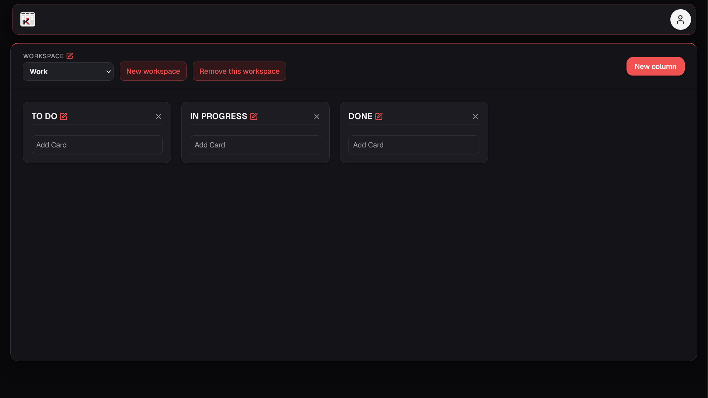

# Kanban

A full-stack Kanban board built with Next.js, React, TypeScript, Prisma, and SQLite.

Users can create an account, manage multiple workspaces, organize columns and cards, and move items through a drag-and-drop interface. Every board operation is protected by session-based authentication and scoped to its owner.

## Preview



## Features

- User registration and sign-in
- Password hashing with bcryptjs
- Database-backed sessions with HTTP-only cookies
- Optional persistent login with **Remember me**
- Protected routes and user-specific data
- Create, switch, rename, and delete workspaces
- Dedicated URL for each workspace
- Protection against deleting the last workspace
- Create, rename, reorder, and delete columns
- Create, rename, move, and delete cards
- Confirmation dialogs for destructive actions
- Contextual loading and error states
- User menu with logout
- Light and dark themes with system preference detection
- Semantic color tokens and reusable UI animations
- Responsive interface

## Authentication

Passwords are hashed before storage. After authentication, the server creates a database session and sends its random token through an HTTP-only cookie.

**Remember me** controls whether the cookie persists for up to 30 days or lasts only for the current browser session. Protected requests validate the token, expiration date, and associated user before accessing any data.


## Workspaces

Each new account receives an initial workspace with three columns: **To Do**, **In Progress**, and **Done**.

Users can create additional workspaces, switch between them, rename them inline, and delete them after confirmation. The final workspace cannot be removed. Successful deletion redirects the user to another available workspace.


## Cards and Columns

Columns and cards are created directly from the board, and their titles can be edited inline. Column editing includes explicit save, cancel, loading, and error feedback.

Cards can be moved between columns, while columns can be reordered across the board. Position changes are persisted through authenticated `PATCH` requests.

Deleting a column also removes its cards through cascading database relations. Card and column deletion both require confirmation.


## User Menu and Theme

The navbar includes a user menu with the current user's name, theme switch, and logout action. The selected theme is stored locally, and the system preference is used when no manual choice exists.

Logging out invalidates the database session, removes the cookie, and redirects the user to the authentication area.


## Tech Stack

- Next.js 16 with App Router
- React 19
- TypeScript
- Tailwind CSS 4
- Prisma ORM 7
- SQLite with `better-sqlite3`
- bcryptjs
- Lucide React

## API Routes

```text
POST    /api/auth/signup
POST    /api/auth/signin
POST    /api/auth/logout

POST    /api/boards
PATCH   /api/boards/[id]
DELETE  /api/boards/[id]

POST    /api/columns
PATCH   /api/columns/[id]
DELETE  /api/columns/[id]

POST    /api/cards
PATCH   /api/cards/[id]
DELETE  /api/cards/[id]
```

All board, column, and card endpoints require a valid session and verify resource ownership.

## Database

```text
User
├── Session
└── Board
    └── Column
        └── Card
```

Boards belong to users, columns belong to boards, and cards belong to columns. Cascading deletes keep related data consistent.

Cards and columns use a floating-point `position` field for ordering.

## Project Structure

```text
src/
├── app/
│   ├── (auth)/
│   ├── api/
│   │   ├── auth/
│   │   ├── boards/
│   │   ├── cards/
│   │   └── columns/
│   ├── board/
│   ├── globals.css
│   └── layout.tsx
├── components/
│   ├── auth/
│   ├── kanban/
│   └── ui/
└── lib/
    ├── auth.ts
    ├── board.ts
    └── Prisma.ts

prisma/
├── migrations/
└── schema.prisma
```

## Getting Started

### Prerequisites

- Node.js
- npm

### Installation

```bash
git clone https://github.com/natajuniorpinheirodasilva-ui/kanban.git
cd kanban
npm install
```

Create a `.env` file:

```env
DATABASE_URL="file:./dev.db"
```

Generate the client, apply migrations, and start the application:

```bash
npx prisma generate
npx prisma migrate dev
npm run dev
```

Open `http://localhost:3000/signup` to create an account.

## Known Limitations

- Cards moved to another column are appended rather than inserted at an exact position.
- The native HTML5 drag-and-drop implementation has limited touch and keyboard support.
- Position values are not automatically rebalanced after many reorder operations.
- Expired sessions are validated but not automatically removed from the database.
- The current SQLite setup must be migrated to a hosted database before production deployment.

## Roadmap

- Adopt dnd-kit for precise sorting, touch support, and keyboard accessibility
- Support exact card placement within and between columns
- Add card descriptions, labels, priorities, and deadlines
- Add profile and account settings
- Migrate from SQLite to hosted PostgreSQL
- Deploy the application to Vercel

## License

This project was created for educational and portfolio purposes.
