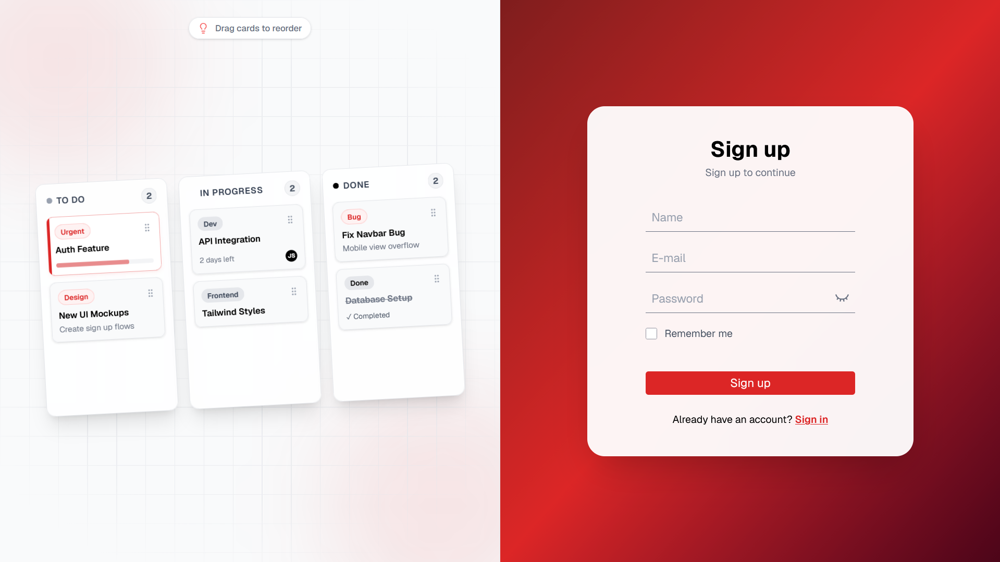
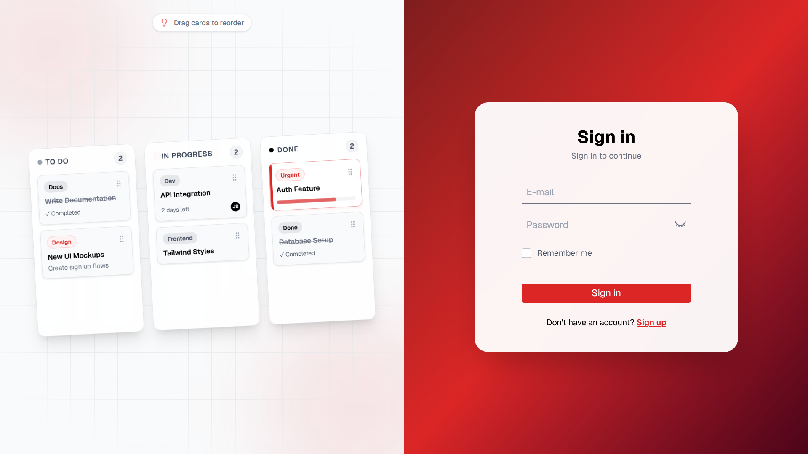
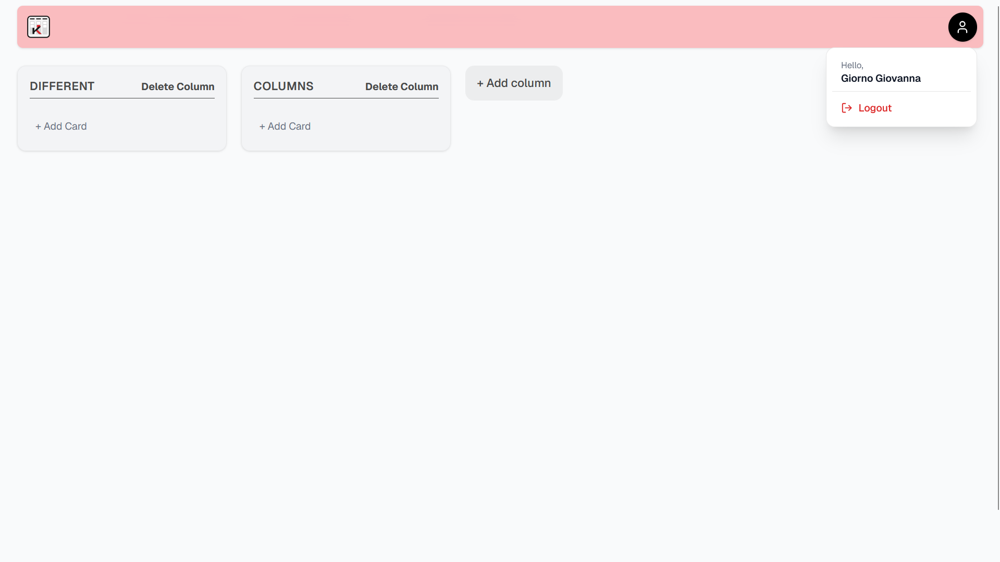
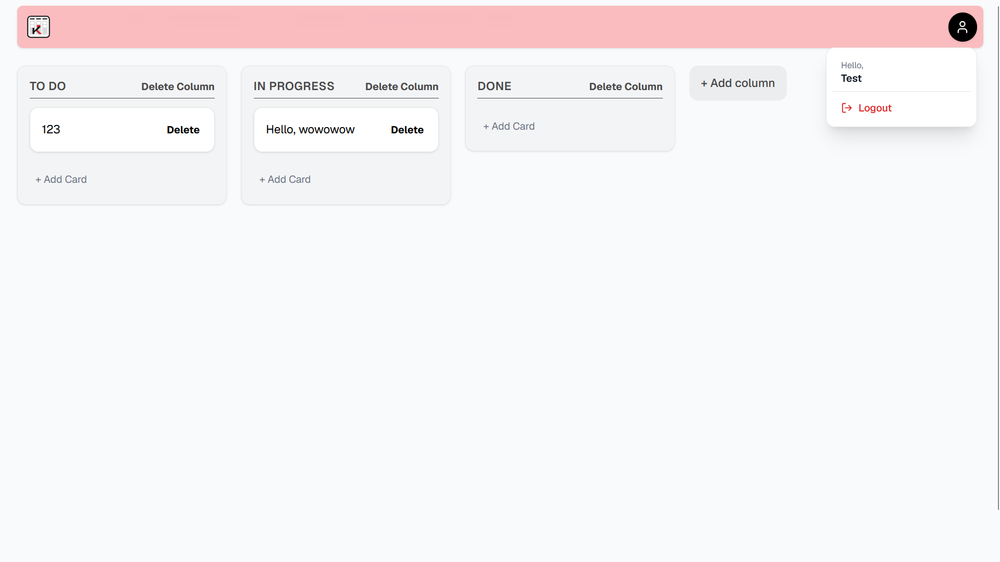
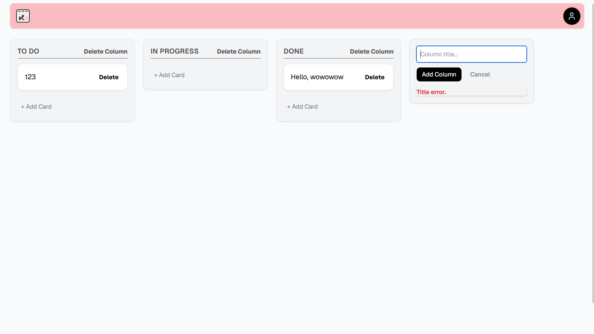
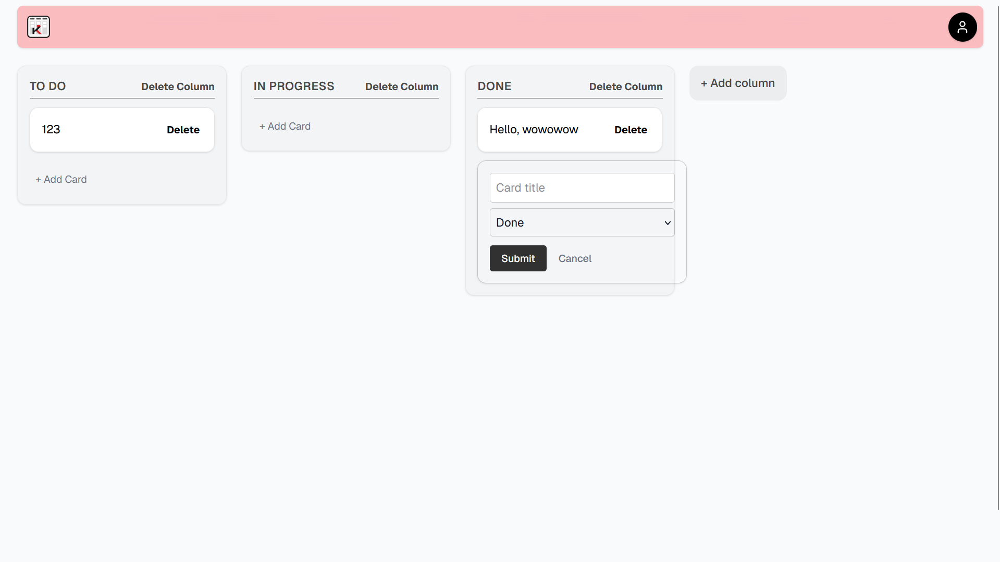
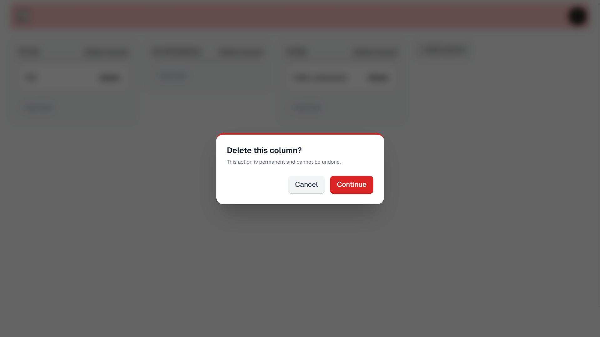

# Kanban

A full-stack Kanban board built with Next.js, React, TypeScript, Prisma, and SQLite.

The application allows users to create an account, manage their own board, and organize cards and columns through a responsive drag-and-drop interface. All changes are persisted through REST-style Route Handlers, and every board operation is scoped to the authenticated user.

## Preview


## Features

- User registration and sign-in
- Password hashing with bcryptjs
- Database-backed authentication sessions
- HTTP-only session cookies
- Optional persistent login with **Remember me**
- Protected board access
- User-specific boards and data isolation
- User menu with logout
- Session invalidation during logout
- Create, edit, and delete columns
- Create, edit, move, and delete cards
- Drag and drop cards between columns
- Reorder columns using drag and drop
- Optimistic UI updates
- Confirmation dialogs for destructive actions
- Persistent data with SQLite and Prisma
- REST API built with Next.js Route Handlers
- Centralized semantic color palette with Tailwind CSS
- Responsive interface

## Authentication

Users can create an account or sign in with an existing one. Passwords are hashed before being stored in the database.

After successful authentication, the backend creates a session associated with the user. Its random token is stored in an HTTP-only cookie, while the session itself remains in the database with an expiration date.

The **Remember me** option controls the cookie behavior:

- When enabled, the cookie persists for up to 30 days.
- When disabled, a browser-session cookie is used.
- The database session still has an expiration date in both cases.

Protected requests validate the cookie token, database session, expiration date, and associated user. The application never trusts a `userId` supplied by the frontend to determine data ownership.





## User-Specific Boards

Each account receives an initial workspace during registration with three columns:

- To Do
- In Progress
- Done

Users can create additional workspaces and switch between them from the board header. Each workspace has its own URL and is loaded only when it belongs to the authenticated user. Card and column endpoints also verify resource ownership before creating, editing, moving, or deleting data.





## User Menu and Logout

The navbar includes a user menu that displays the current user's name and provides the logout action as showed above.

Logging out removes the current session from the database, deletes the session cookie, and redirects the user to the authentication area. The menu also closes when clicking outside it or pressing `Escape`.

## Drag and Drop

The board currently uses the native HTML5 Drag and Drop API without an external drag-and-drop library.

Cards can be moved between columns, and columns can be reordered across the board. The interface updates optimistically while the new position is persisted through `PATCH` requests.


## Card and Column Management

Cards and columns can be created directly from the board. Their titles support inline editing, and destructive actions require confirmation.

Deleting a column also deletes its cards through Prisma's cascading delete behavior.







## Design System

The interface uses a white, gray, black, and red visual identity. Reusable semantic colors such as `primary`, `danger`, `background`, and `surface` are defined in `globals.css` and exposed to Tailwind CSS.

Shared animations, including the reusable `hover-lift` interaction, are also defined globally to keep component styles consistent.

## Tech Stack

- Next.js 16 with App Router
- React 19
- TypeScript
- Tailwind CSS 4
- Prisma ORM 7
- SQLite
- `@prisma/adapter-better-sqlite3`
- bcryptjs
- Lucide React

## Project Structure

```text
src/
├── app/
│   ├── (auth)/
│   │   ├── signin/
│   │   └── signup/
│   ├── api/
│   │   ├── auth/
│   │   │   ├── signin/
│   │   │   ├── signup/
│   │   │   └── logout/
│   │   ├── cards/
│   │   └── columns/
│   ├── board/
│   ├── globals.css
│   └── layout.tsx
├── components/
│   ├── auth/
│   ├── kanban/
│   └── ui/
└── lib/
    ├── auth.ts
    ├── board.ts
    └── Prisma.ts

prisma/
├── migrations/
└── schema.prisma
```

## API Routes

### Authentication

```text
POST    /api/auth/signup
POST    /api/auth/signin
POST    /api/auth/logout
```

### Cards

```text
POST    /api/cards
PATCH   /api/cards/[id]
DELETE  /api/cards/[id]
```

### Workspaces

```text
POST    /api/boards
```

### Columns

```text
POST    /api/columns
PATCH   /api/columns/[id]
DELETE  /api/columns/[id]
```

All workspace, card, and column routes require a valid session and verify that the requested resource belongs to the authenticated user.

## Database

The project uses SQLite through Prisma ORM. Its main relationships are:

```text
User
├── Session
└── Board
    └── Column
        └── Card
```

- A user can own boards and sessions.
- A session belongs to one user.
- A board belongs to one user.
- A column belongs to one board.
- A card belongs to one column.
- Cascading deletes are configured where appropriate.

## Ordering

Cards and columns use a floating-point `position` field to determine their order.

New items receive spaced position values, and drag-and-drop operations calculate updated positions before persisting them. This avoids rewriting every record during simple reorder operations.

## Getting Started

### Prerequisites

- Node.js
- npm

### Installation

Clone the repository:

```bash
git clone https://github.com/natajuniorpinheirodasilva-ui/kanban.git
cd kanban
```

Install the dependencies:

```bash
npm install
```

Create a `.env` file in the project root:

```env
DATABASE_URL="file:./dev.db"
```

Generate the Prisma Client:

```bash
npx prisma generate
```

Apply the database migrations:

```bash
npx prisma migrate dev
```

Start the development server:

```bash
npm run dev
```

Open `http://localhost:3000/signup` to create an account.

## Known Limitations

- Cards moved to another column are appended instead of inserted at an exact drop position.
- Position values are not automatically rebalanced after many reorder operations.
- The current drag-and-drop implementation has limited touch and keyboard support.
- Expired sessions are validated but not automatically removed from the database.

## Roadmap

- Adopt dnd-kit for improved sorting, touch support, and keyboard accessibility
- Support exact card placement within and between columns
- Add automatic position rebalancing
- Add profile and settings options to the user menu
- Add automatic cleanup for expired sessions

## License

This project was created for educational and portfolio purposes.
