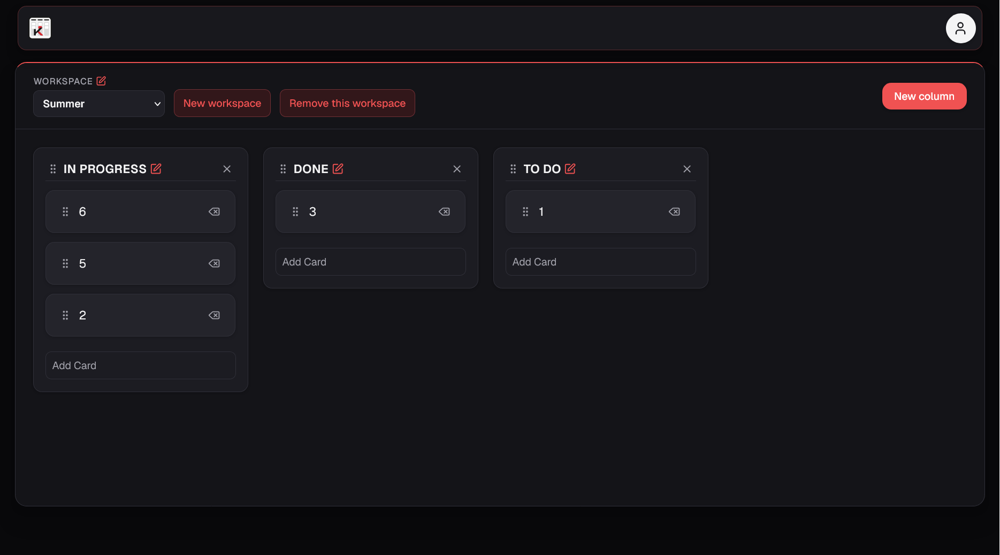
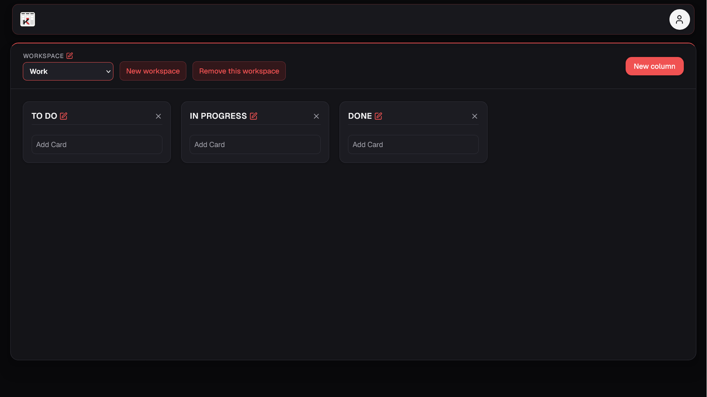
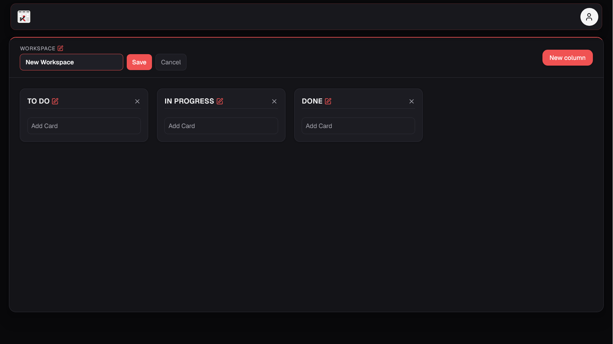
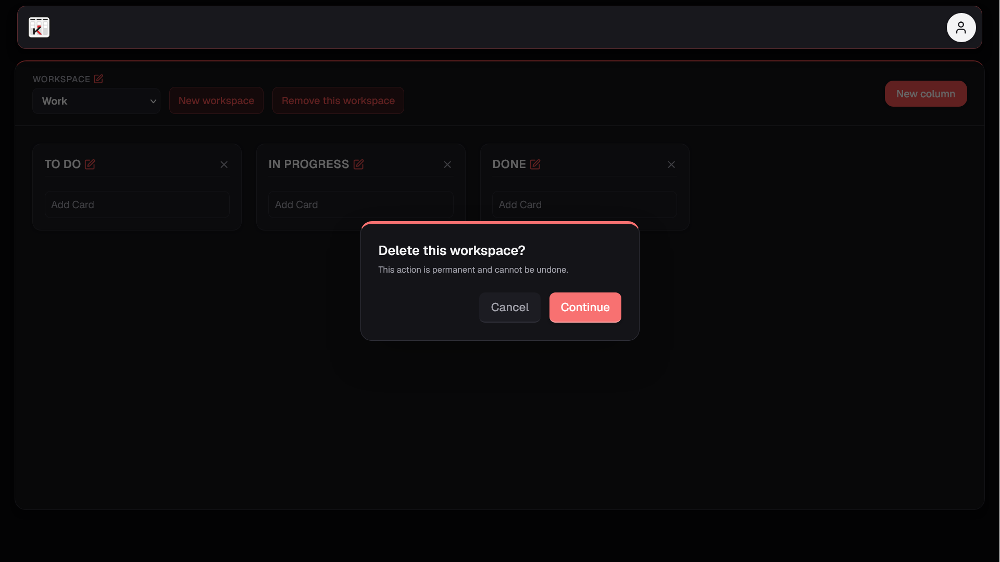
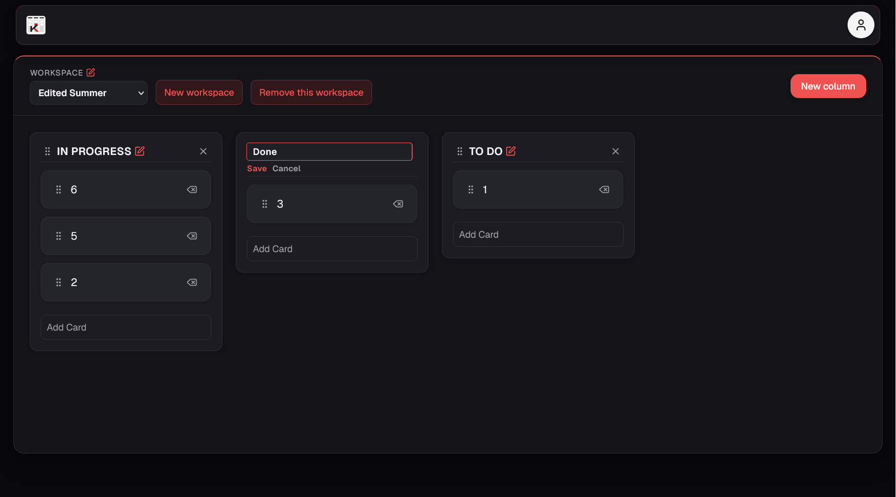
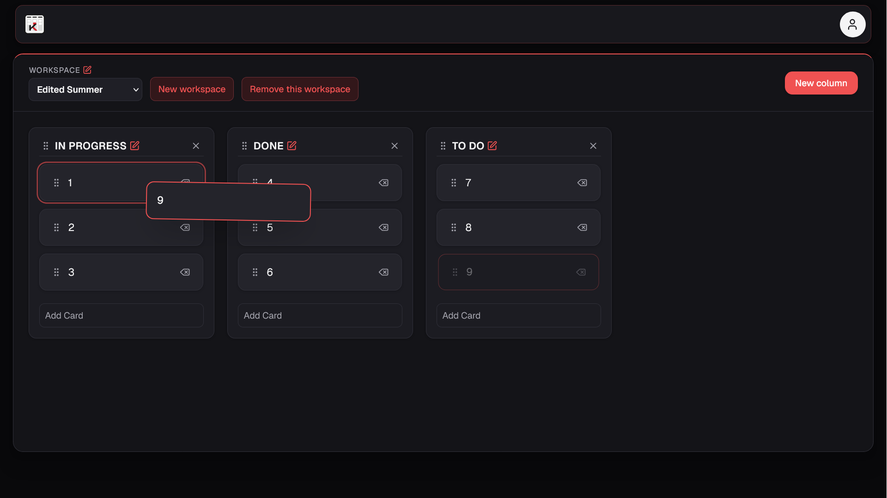
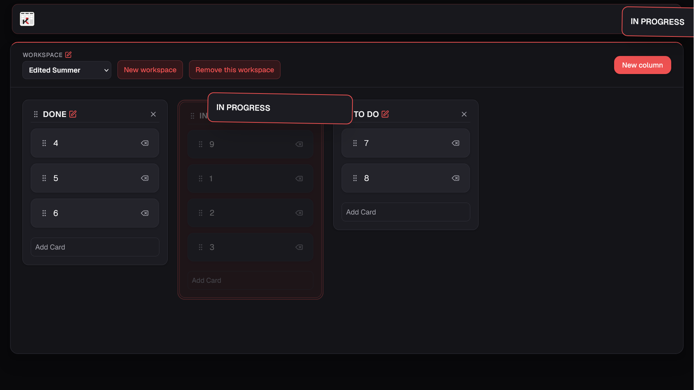
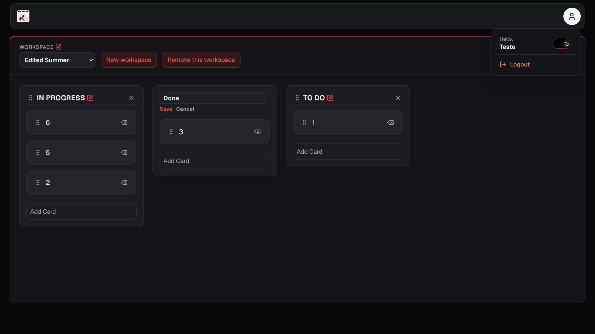
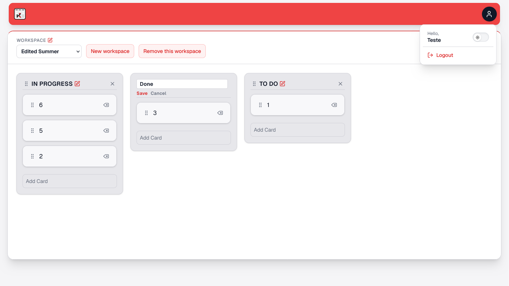

# Kanban

A full-stack Kanban application built with Next.js, React, TypeScript, Prisma, and SQLite.

The project provides authenticated, user-specific workspaces where columns and cards can be created, edited, deleted, and reordered through a modern drag-and-drop interface.

## Preview



## Main Features

- Account creation, sign-in, and logout
- Password hashing with bcryptjs
- Database-backed sessions using HTTP-only cookies
- Optional persistent authentication with **Remember me**
- Protected routes and ownership validation on every board operation
- Multiple workspaces with dedicated URLs
- Workspace creation, switching, inline renaming, and deletion
- Protection against deleting the user's final workspace
- Column creation, inline editing, deletion, and reordering
- Card creation, inline editing, deletion, and precise reordering
- Card movement within and between columns using dnd-kit
- Card details with descriptions, priorities, labels, and due dates
- Visual insertion indicator above or below the destination card
- Confirmation dialogs and contextual error/loading feedback
- Light and dark themes with system preference detection
- Responsive interface with reusable colors and animations

## Authentication

Passwords are hashed before being stored. After a successful sign-up or sign-in, the server creates a database session and returns its random token in an HTTP-only cookie.

When **Remember me** is enabled, authentication can persist for up to 30 days. Otherwise, the cookie lasts only for the current browser session. Protected operations validate the token, expiration date, user, and resource ownership before accessing or changing data.


## Workspace Management

Every new account starts with a workspace containing three default columns: **To Do**, **In Progress**, and **Done**.

Users can create additional workspaces, switch between them, rename their titles inline, and delete them after confirmation. When a workspace is removed, the application redirects to another available workspace. The final workspace cannot be deleted.







## Board Management

Columns and cards are managed directly from the board. Titles can be edited inline, with save, cancel, loading, and error states where appropriate. Destructive actions require confirmation.

The board uses dnd-kit to reorder columns and to position cards precisely within the same column or across different columns. A red insertion line shows whether the card will be placed above or below the current target. Every successful movement is persisted in the database.

Deleting a column also removes its cards through cascading database relations.








## User Menu and Themes

The user menu displays the current user's name and provides theme and logout controls. The selected theme is stored locally, while the system preference is used when no manual selection exists.

Logging out invalidates the database session, removes the authentication cookie, and redirects the user to the authentication area.





## Tech Stack

- Next.js 16 with App Router
- React 19
- TypeScript
- Tailwind CSS 4
- dnd-kit
- Prisma ORM 7
- SQLite with better-sqlite3
- bcryptjs
- Lucide React

## API Routes

```text
POST    /api/auth/signup
POST    /api/auth/signin
POST    /api/auth/logout

POST    /api/boards
PATCH   /api/boards/[id]
DELETE  /api/boards/[id]

POST    /api/columns
PATCH   /api/columns
PATCH   /api/columns/[id]
DELETE  /api/columns/[id]

POST    /api/cards
PATCH   /api/cards
PATCH   /api/cards/[id]
DELETE  /api/cards/[id]
```

The collection-level `PATCH` routes persist reordered columns and cards in batches. All board-related endpoints require a valid session and verify that the requested resources belong to the authenticated user.

## Database Structure

```text
User
├── Session
└── Board
    └── Column
        └── Card
```

Boards belong to users, columns belong to boards, and cards belong to columns. Cascading relations keep associated data consistent when a parent resource is deleted.

Columns and cards use a numeric `position` field to preserve their order.

## Project Structure

```text
src/
├── app/
│   ├── (auth)/
│   ├── api/
│   │   ├── auth/
│   │   ├── boards/
│   │   ├── cards/
│   │   └── columns/
│   ├── board/
│   ├── globals.css
│   └── layout.tsx
├── components/
│   ├── auth/
│   ├── kanban/
│   └── ui/
├── generated/
│   └── prisma/
└── lib/

prisma/
├── migrations/
└── schema.prisma
```

## Getting Started

### Prerequisites

- Node.js
- npm

### Installation

```bash
git clone https://github.com/natajuniorpinheirodasilva-ui/kanban.git
cd kanban
npm install
```

Create a `.env` file in the project root:

```env
DATABASE_URL="file:./dev.db"
```

Generate the Prisma client, apply the migrations, and run the development server:

```bash
npx prisma generate
npx prisma migrate dev
npm run dev
```

Open `http://localhost:3000/signup` to create an account.

## Current Limitations

- Position values are not automatically rebalanced after extensive reordering.
- Expired sessions are validated but are not automatically removed from the database.
- The local SQLite database must be replaced with a hosted database for Vercel deployment.

## Roadmap

- Add profile and account settings
- Improve keyboard accessibility for board reordering
- Migrate from SQLite to hosted PostgreSQL
- Deploy the application to Vercel

## License

This project was created for educational and portfolio purposes.
