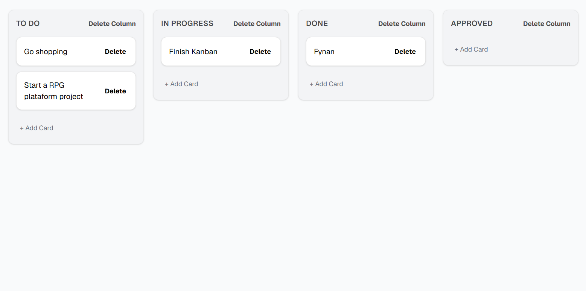
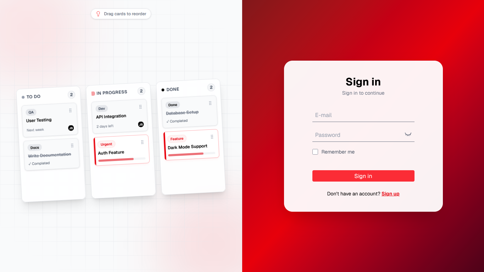
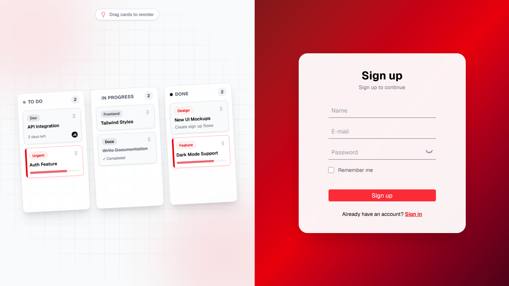
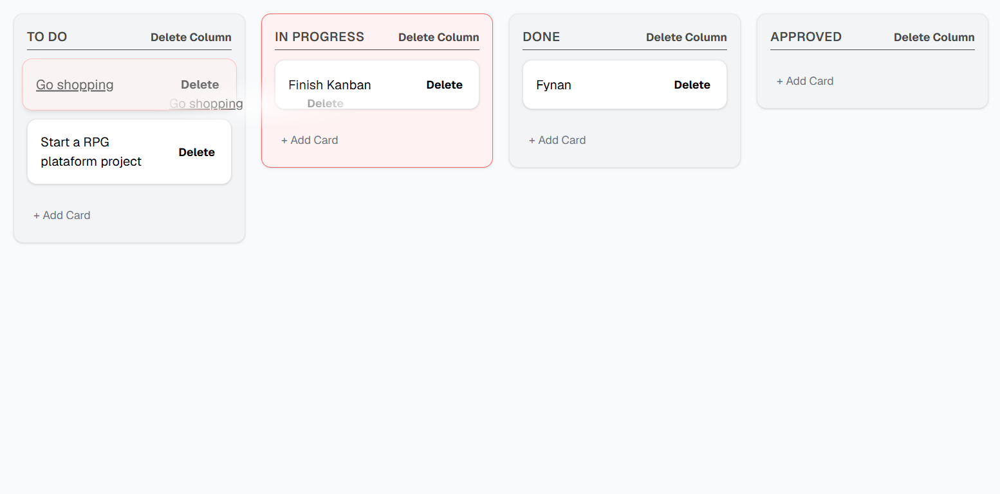
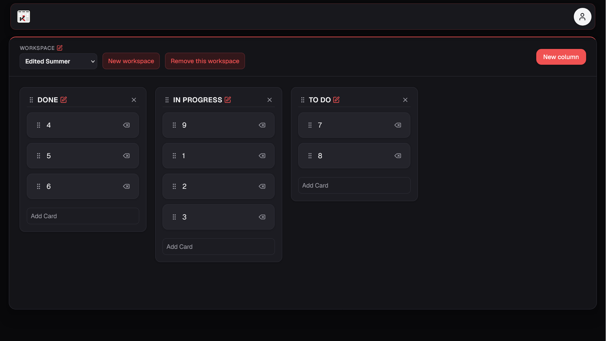

# Kanban

A full-stack Kanban board built with Next.js, TypeScript, Prisma, and SQLite.

The project provides a task management interface where users can create, edit, delete, and reorder columns and cards. Changes are persisted to a SQLite database through REST API routes built with Next.js Route Handlers.

Authentication is currently being implemented with user accounts, password hashing, database-backed sessions, and HTTP-only cookies.

## Preview



## Features

- Create, edit, and delete cards
- Create, edit, and delete columns
- Drag and drop cards between columns
- Reorder columns using drag and drop
- Optimistic UI updates
- Persistent data using SQLite
- REST API built with Next.js Route Handlers
- Confirmation dialog before deleting cards or columns
- Responsive interface
- Sign in and sign up
- Password hashing
- Database-backed user sessions
- Remember me support
- Server-side validation

### Authentication

The application includes sign-in and sign-up flows connected to the backend.

Passwords are hashed before being stored in the database. After successful authentication, a session is created and associated with the user.

The session token is stored in an HTTP-only cookie instead of exposing authentication data directly to client-side JavaScript.

The **Remember me** option controls whether the authentication cookie persists after the browser session ends.

Authentication is still being integrated with the rest of the application. Protected board access and logout are not yet implemented.




### Drag and Drop

The board uses the native HTML5 Drag and Drop API without external drag-and-drop libraries.

Cards can be moved between columns, while columns can be reordered across the board. Changes are immediately reflected in the interface and persisted to the database through `PATCH` requests.




### Card and Column Management

Cards and columns can be created directly from the board and their titles can be edited inline.

Deleting a column also removes its cards through Prisma's cascading delete behavior.


## Tech Stack

- Next.js
- React 19
- TypeScript
- Tailwind CSS
- Prisma ORM 7
- SQLite
- bcryptjs
- `@prisma/adapter-better-sqlite3`

## Project Structure

```text
src/
├── app/
│   ├── (auth)/
│   │   ├── signin/
│   │   └── signup/
│   ├── api/
│   │   ├── auth/
│   │   │   ├── signin/
│   │   │   └── signup/
│   │   ├── cards/
│   │   └── columns/
│   ├── layout.tsx
│   └── page.tsx
│
├── components/
│   ├── auth/
│   ├── ConfirmDialog.tsx
│   ├── Kanban.tsx
│   ├── NewCardForm.tsx
│   └── NewColumnForm.tsx
│
└── lib/
    ├── board.ts
    └── Prisma.ts

prisma/
├── schema.prisma
└── seed.ts
```

## API

The application uses REST-style Route Handlers for authentication, card, and column operations.

### Authentication

```text
POST    /api/auth/signin
POST    /api/auth/signup
```

### Cards

```text
POST    /api/cards
PATCH   /api/cards/[id]
DELETE  /api/cards/[id]
```

### Columns

```text
POST    /api/columns
PATCH   /api/columns/[id]
DELETE  /api/columns/[id]
```

## Database

The project uses SQLite with Prisma ORM.

The current data model follows this structure:

```text
User
├── Board
│   └── Column
│       └── Card
│
└── Session
```

Users can own boards and authentication sessions. Sessions store a unique token and expiration date used by the authentication system.

## Ordering

Cards and columns contain a `position` field used to determine their order.

Instead of sequential integers, new items use spaced positions. When an item is moved between two others, its new position can be calculated using the values of its neighbors.

This allows reordering without updating the position of every item on the board.

## Getting Started

### Prerequisites

Make sure you have Node.js and npm installed.

### Installation

Clone the repository:

```bash
git clone https://github.com/natajuniorpinheirodasilva-ui/kanban.git
cd kanban
```

Install the dependencies:

```bash
npm install
```

Create the environment file:

```bash
cp .env.example .env
```

Generate the Prisma Client:

```bash
npx prisma generate
```

Run the database migrations:

```bash
npx prisma migrate dev
```

Start the development server:

```bash
npm run dev
```

Open `http://localhost:3000` in your browser.

## Known Limitations

- Authentication is not yet connected to protected board access
- Logout is not yet implemented
- Cards dropped into another column are appended to the end instead of being inserted at the exact drop position
- The `position` system does not currently perform automatic rebalancing
- Multi-board support is not yet implemented

## Roadmap

- Protect board routes using the authenticated session
- Load boards based on the authenticated user
- Implement logout and session invalidation
- Improve card positioning during drag and drop
- Add support for multiple boards

## License

This project is for educational and portfolio purposes.